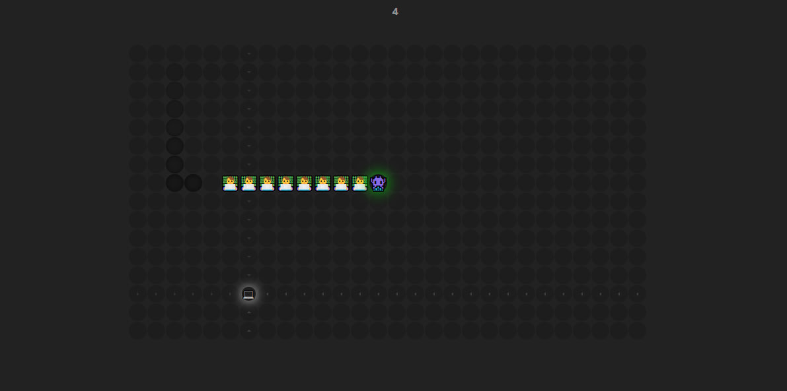

# 🐍 Snake Game - بازی مار نئونی

یک بازی کلاسیک مار با طراحی مدرن، نئونی و بومی‌سازی‌شده برای فارسی‌زبانان! در این بازی، مار با نماد 👾 و بدنه 👨‍💻 در محیطی نئونی حرکت می‌کند تا 💻 (غذا) را جمع‌آوری کند و امتیاز بگیرد.

## [Play](https://phix0n-z3r.github.io/snake-game/)

<p align="center">
  
</p>

---

## ✨ ویژگی‌ها

- 🎨 طراحی نئونی با رنگ‌های سبز و سفید
- 👾 استفاده از ایموجی‌های جذاب برای مار، بدن و غذا
- 🌐 رابط کاربری راست‌به‌چپ (RTL) مناسب برای فارسی‌زبان‌ها
- 🎮 کنترل ساده با کلیدهای جهت‌نما (Arrow Keys)
- 💯 شمارش امتیاز با هر بار گرفتن غذا

---

## 📦 پیش‌نیازها

- مرورگر مدرن (Chrome, Firefox, Safari)

---

## 🚀 نصب و اجرا

```bash
# ۱. کلون کردن مخزن
git clone https://github.com/your-username/snake-game.git

# ۲. ورود به پوشه پروژه
cd snake-game

# ۳. اجرای فایل index.html به یکی از روش‌های زیر:
# اجرای لوکال ساده با Python (در صورتی که Python نصب است):
python3 -m http.server 8000

# حالا مرورگر را باز کنید و بروید به:
http://localhost:8000
